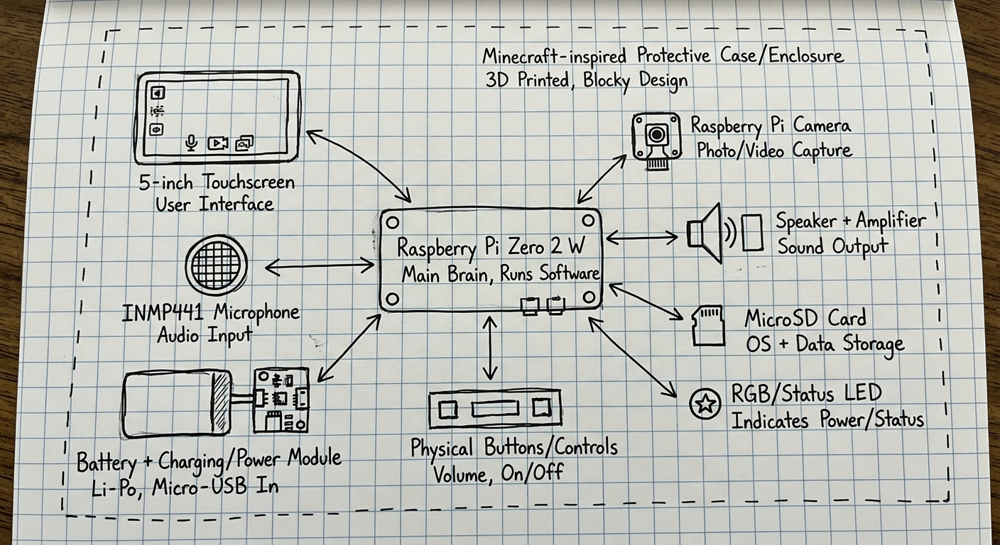

---
title: "Redstone AI"
author: "Saad ZAKARIA"
description: "An innovative interactive companion to help your routine smarter, easier, and more enjoyable through natural interaction."
created_at: "2026-10-03"
---

# Octobre 3: Part picking

Hello!! it's my first day on the project, so as a grown man have 15 yo, I decide to pick the parts.
I 'll use the Raspberry Pi Zero 2 W as the brain of the project, thanks to the low-power usage and powerful processor that can run all the other components. And a 5" touchscreen to control the agent by touch, as well as the INMP441 as the microphone for a the voice commands, speaker for the communication (with an AMP ofc), and a Raspberry Pi Cam model for the hand gesture recognition 
what did i forget? ahh the battery so it can be portable, some button or a large screen like the Stream Deck, and the cooling so it doesn't over heat

**Total time spent: 1 hours**

# Octobre 4: PCB parts picking

Hello!! so for today i didn't do much, i just search for the parts schematics online with there pricing, but the PCB layout is still empty, so see you tomorrow (it'll be a VERYY hard day, cuz i have to work from school without internet and without a TABLE TO PUT MY LAPTOP ON!!!!!!!!!) 

**Total time spent: 1 hours**
